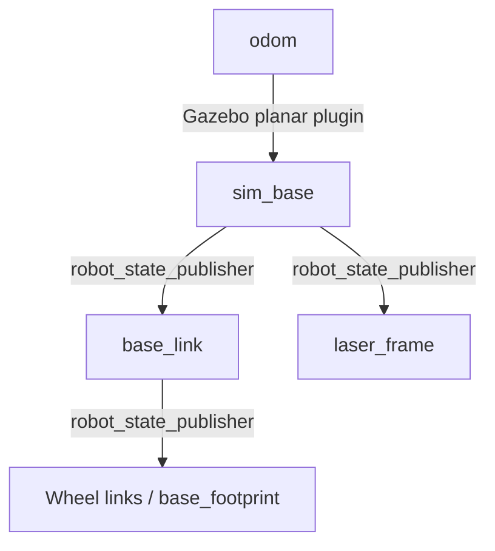
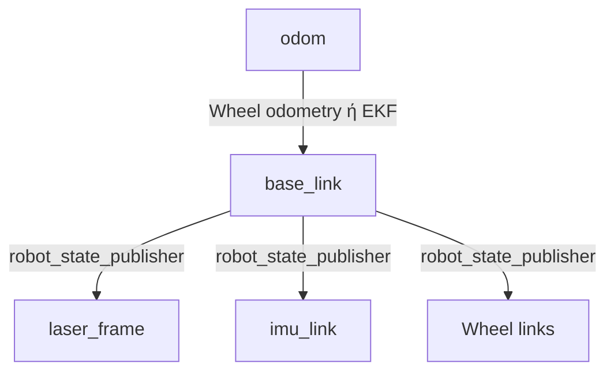
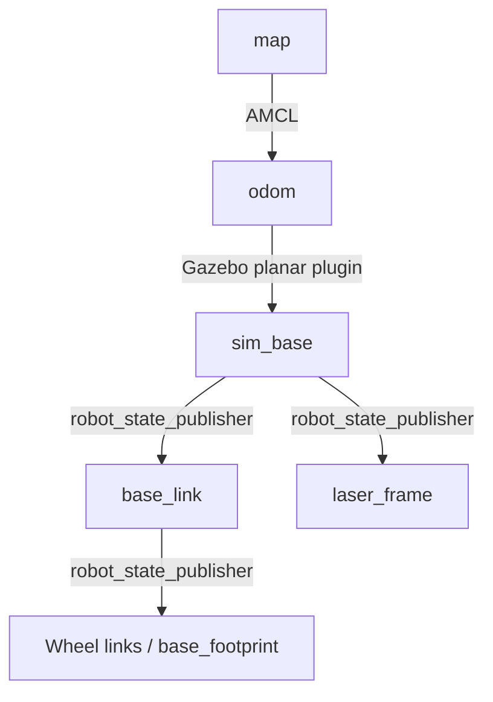
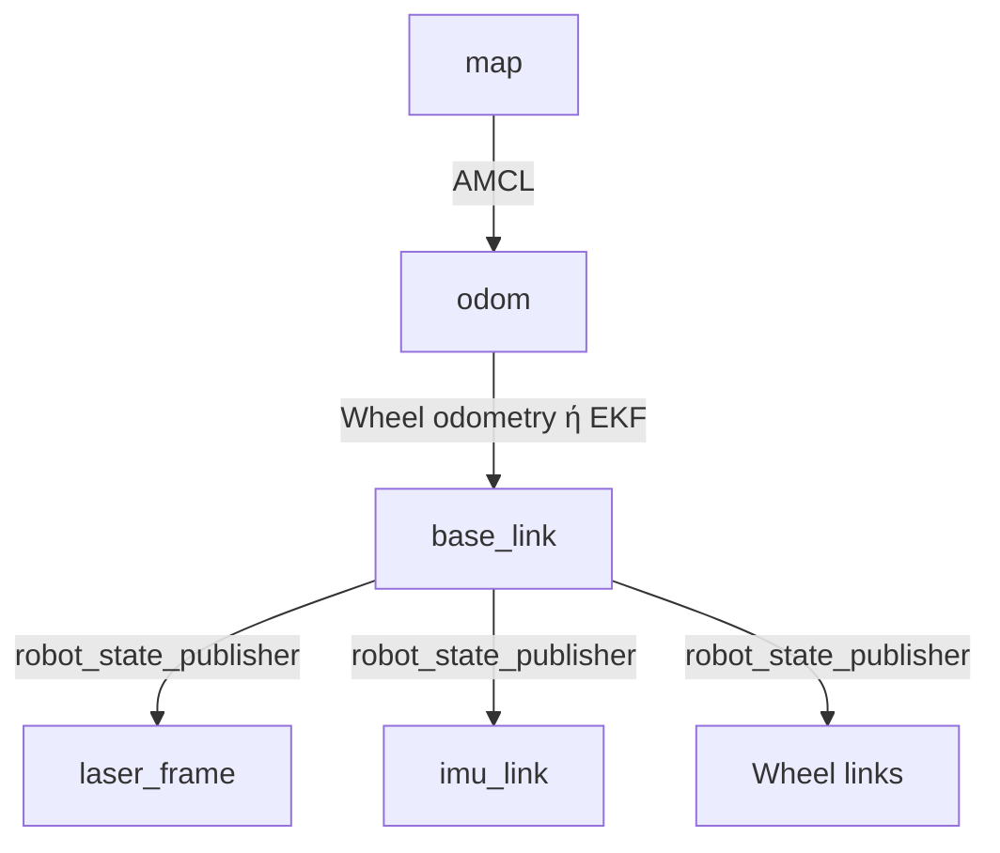
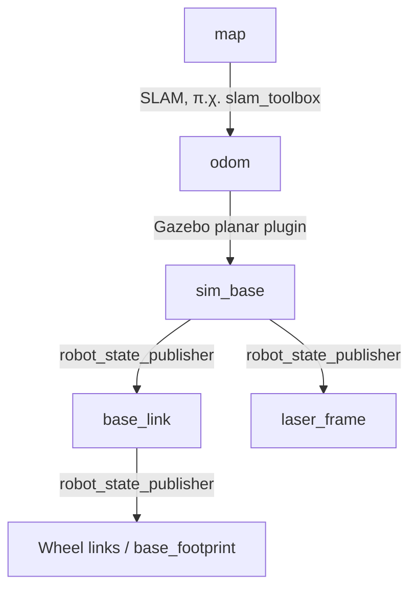
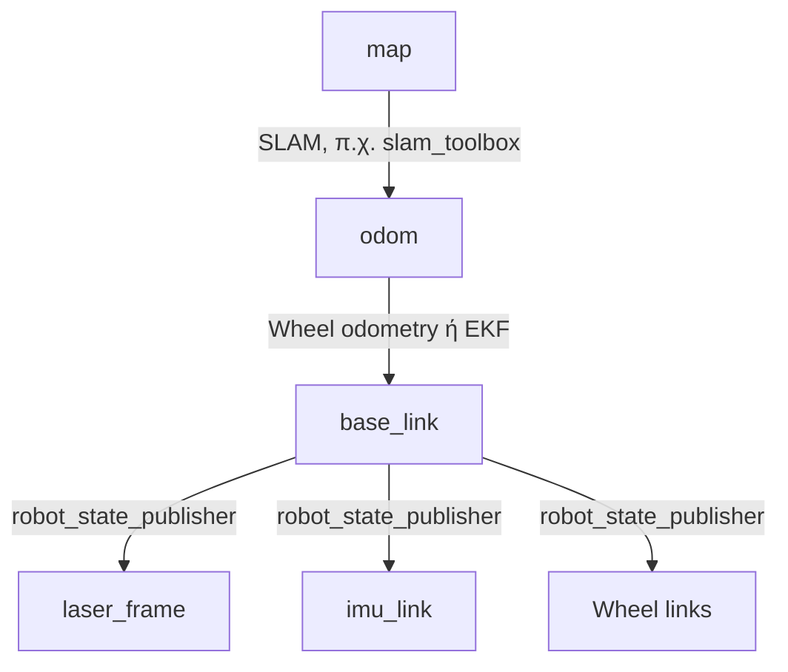

## Refresh προηγούμενης φοράς
The working docker image uses ROS 2 Humble and Gazebo Classic because the reused PMB2/HuNav environment was built on that stack.

####   Vanilla DWAL 

DWAL is currently not loaded as a `nav2_core::Controller` plugin.

It operates as two normal ROS nodes:

| Node | Inputs | Outputs |
|---|---|---|
| `dwal_generator` | `/odom`, `/local_costmap/costmap` | sampled paths and path markers |
| `dwal_clustering` | sampled paths | near/far cluster groups and markers |

Confirmed DWAL topics:

- `/dwal_planner/sampled_paths`
- `/dwal_planner/sampled_pathMarkers`
- `/dwal_planner/clusters_near`
- `/dwal_planner/clusters_far`
- `/dwal_planner/cluster_markers_near`
- `/dwal_planner/cluster_markers_far`

DWAL also exposes two custom services:

- `/dwal_planner/toggle_cluster_spin`
- `/dwal_planner/toggle_cluster_slice`

There are no DWAL actions.
## Σχόλια προηγούμενης φοράς

1. Έκανα headless gazebo 
   `scripts/run_dwal_cafe.sh`
2. Έλεγξα τα collisions όταν το box ακουμπήσει σταματά. 
   `src/crowd_aware_simulation/scripts/prepare_scene.py`
   Το κουτί ακουμπά τον τοίχο και το ρομπότ περιστρέφεται μέχρι να ευθυγραμμιστεί μαζί του. 
   creates a physical `navigation_envelope` collision box
   Ωστοσο δεν αλληλεπιδρά με:
	1. Τραπέζια 
	   **`is_static: True`**. Όσα τραπέζια αποτελούν μέρος αυτού του μοντέλου παραμένουν ακίνητα στις συγκρούσεις. Για να σπρώχνονται, χρειάζονται ξεχωριστά **δυναμικά μοντέλα**, με μάζα, αδράνεια και collision geometry.
	2. Ανθρώπους
	   Gazebo **actors**, όπως αναμένεται στο HuNav setup σου, η κίνησή τους ελέγχεται από animation/plugin. Οι actors δεν μετακινούνται από δυνάμεις επαφής, ακόμη κι αν φαίνονται να περπατούν. Για να αντιδρούν σε σπρώξιμο απαιτείται πρόσθετη υλοποίηση·


## A lot of studying ros2 and nav2 concepts later ...
## Iwalk 
### ΒΤ 

robot behavior tree and no `bt_navigator`


### TF tree
The runtime TF tree is real and is assembled by two publishers:

```text
Gazebo planar plugin:
odom → sim_base

robot_state_publisher:
sim_base → base_link → wheels/base_footprint
         → laser_frame
```
#### 1. Προσομοίωση — local only

#### 2. Πραγματικό ρομπότ — local only


#### 3. Προσομοίωση — γνωστός χάρτης
Για «πήγαινε στο δωμάτιο Α» χρειάζεσαι:

- Αντιστοίχιση **«δωμάτιο Α» → θέση στόχου στο `map`**.
- Global planner για τη διαδρομή μέχρι εκεί.
- Local controller για την εκτέλεση και την τοπική αποφυγή εμποδίων.
  


#### 4. Πραγματικό ρομπότ — γνωστός χάρτης


#### 5. Προσομοίωση — άγνωστο περιβάλλον, με SLAM
**Πώς λειτουργεί το «πήγαινε στο δωμάτιο αυτό» σε άγνωστο περιβάλλον;**

**Αν δεν ξέρει ούτε πού είναι το δωμάτιο ούτε πώς να το αναγνωρίσει, δεν μπορεί να μετατρέψει την εντολή σε συγκεκριμένο στόχο.** Το SLAM βρίσκει γεωμετρία· δεν γνωρίζει από μόνο του ότι ένας χώρος λέγεται «Γραφείο 203».

Υπάρχουν τρεις περιπτώσεις:

|Τι πληροφορία διαθέτει|Τι μπορεί να κάνει|
|---|---|
|Έχει ήδη εξερευνήσει το δωμάτιο και το έχεις ονομάσει|Μετατρέπει το όνομα σε θέση στο `map` και σχεδιάζει διαδρομή.|
|Δεν ξέρει τη θέση, αλλά μπορεί να το αναγνωρίσει, π.χ. από πινακίδα «203»|Εξερευνά, χαρτογραφεί και αναζητά την πινακίδα μέχρι να εντοπίσει τον στόχο.|
|Του δείχνεις μια ορατή πόρτα ή δίνεις σχετικό στόχο|Μπορεί να κινηθεί προς αυτόν, εφόσον τον εντοπίζει και υπάρχει προσβάσιμη διαδρομή.|


#### 6. Πραγματικό ρομπότ — άγνωστο περιβάλλον, με SLAM



Εμείς δουλεύουμε στο πλαίσιο 1-2 θα γίνει ποτέ επέκταση σε κάποιο από τα επόμενα?


### NAV2 stack
![[nav2_servers_diagram.png]]

## Implemented

### 3 άξονες
1. Ένα context node 
2. Δοκιμή διαφορετικών controllers
3. Διαφορετικά scenarios για διαφορετικά usecases
### 1. Context-Dependent Use Cases
`src/crowd_aware_simulation/scripts/context_estimator.py`
```text

LiDAR + tracked pedestrians
        ↓
υπολογισμός 8 heuristic scores
        ↓
εύρεση ισχυρότερου score
        ↓
margin 0.12 + dwell time 1.5 s
        ↓
ενεργό context profile
```

|Scenario|Διάταξη|
|---|---|
|Open area|Χωρίς κοντινά εμπόδια, λίγοι agents|
|Narrow corridor|Δύο παράλληλοι τοίχοι/σειρές επίπλων|
|Doorway|Στενό άνοιγμα ανάμεσα σε εμπόδια|
|Junction|Διάδρομοι που σχηματίζουν Τ ή σταυρό|
|Crossing|Agent διασχίζει κάθετα την πορεία|
|Dense crowd|Πολλοί agents κοντά στην πορεία|
|Occlusion|Agent εμφανίζεται πίσω από εμπόδιο|
|Group blocking|Στατική/κινούμενη ομάδα μπροστά|
|Target confusion|Intended user μαζί με παρόμοιους distractors|

### 2. Working Experiments: Διαφορετικοί controllers

|Controller|Crowd semantics OFF|Crowd semantics ON|
|---|---|---|
|Fixed-radius DWAL + shared controller|yes|yes|
|DWB|yes|yes|
|HATEB|yes|yes|
|Dynamic-radius DWAL + shared controller|yes|yes|

|Σύγκριση|Τι απομονώνει|
|---|---|
|Fixed DWAL ON − OFF|επίδραση social scoring|
|DWB ON − OFF|επίδραση των CoHAN social costmap layers|
|HATEB ON − OFF|επίδραση human trajectory constraints|
|Dynamic DWAL ON − OFF|context-aware radius/speed και social scoring|
### 3. Working Experiments: Διαφορετικά scenarios
`<scenario>`
```text

junction

narrow_corridor

group_blocking

dense_crowd

crossing

cafe

target_confusion **

doorway

occlusion **

open_area
```
# Code
### mini tutorial

```bash

SCENARIO=<scenario> REFERENCE_MODE=teleop GUI=true HEADLESS=false RVIZ=true bash scripts/run_dwal_cafe.sh run <controller> <on|off> <seed>

```

example

```bash

SCENARIO=crossing REFERENCE_MODE=teleop GUI=true HEADLESS=false RVIZ=true bash scripts/run_dwal_cafe.sh run hateb on 1

```

```bash

bash scripts/run_dwal_cafe.sh teleop

```

  
`<scenario>`
```text

junction

narrow_corridor

group_blocking

dense_crowd

crossing

cafe

target_confusion **

doorway

occlusion **

open_area
```

`<controller>`
```text
fixed_dwal
dynamic_dwal
dwb
hateb
```

`<seed>`

```text

Θετικός ακέραιος:
1, 2, 3, ..., 10
```

### if agent stack

```bash
docker exec -it iwalk_dwal bash

source /dwal_entrypoint.sh
```

Μέσα από το docker κάνε κλικ στον agent και βρες το όνομά του μετά
```bash
gz model -m agent1 -x 4.0 -y 1.5
```


### Παρατηρήσεις
#### teleop experiments
dwb ->περναει μέσα από εμπόδια
 όχι οπισθεν
hateb ->only got stale teleop input
 
stale teleop input annoying

οπισθεν δεν δουλευει ποτέ
debug με rosbag

### Ερωτήσεις

1. Θέλετε να κάνω τα τραπέζι μη κολλημένα?
2. Θέλετε να κάνω τους  agents να μπορούν να σπρωχθουν σε περίπτωση σύγκρουσης?
3. Θέλετε αντί για   Teleop του robot

```
keyboard → reference Twist → Path → controller → robot
```

να κάνω Teleop του intended user/patient

```
keyboard → intended HuNav user
                    ↓
tracking/front-following system
                    ↓
robot controller
```
4. Extra debugging με rosbag (θέματα με collisions)
5. Θέλουμε όπισθεν?
6. Θα ήθελα να δουλέψω σε BT για συνολικό iwalk


## Μελλοντικό BT notes
(Nav2 already provides an [`IsBatteryLow`](https://docs.nav2.org/rolling/configuration_and_development/configuration_guide/core_servers/bt_plugins/conditions/IsBatteryLow/) BT condition. It can be used in a navigation or mission tree when a valid `sensor_msgs/BatteryState` topic exists.)


The BT does not need raw BMS details. A battery driver does need:

- the BMS communication protocol;
- pack voltage range and cell count;
- state-of-charge source/calibration;
- current sign convention;
- presence, fault, and health information;
- timestamps and communication timeout;
- low and critical thresholds;
- defined behavior for stale or invalid data.


## Consistency notes
#### Rules

All controller configurations must use:

- the same iWalk URDF-derived geometry;
    
- the same robot footprint and footprint padding;
    
- the same collision geometry;
    
- the same base, odometry, and sensor frames;
    
- the same odometry source and motion plugin;
    
- exactly one publisher for `odom → sim_base`;
    
- the same LiDAR pose, field of view, range, frequency, and filtering;
    
- the same costmap dimensions, resolution, update rate, and reference frame;
    
- the same obstacle and inflation-layer parameters;
    
- the same velocity, acceleration, and deceleration limits;
    
- the same forward-only motion restriction;
    
- the same velocity smoother;
    
- the same collision monitor;
    
- the same command guard and final watchdog;
    
- the same command timeouts and stale-input behaviour;
    
- the same initial robot pose;
    
- the same goal and reference/global path;
    
- the same goal tolerances and progress/failure criteria;
    
- the same scenario geometry and static obstacles;
    
- the same agents, initial poses, goals, behaviours, and walking parameters;
    
- the same intended user, when front-following is evaluated;
    
- the same paired random seed;
    
- the same sensing, latency, visibility, and noise assumptions;
    
- the same simulation timestep and real-time/update settings;
    
- the same experiment duration and timeout;
    
- the same startup and warm-up period;
    
- the same success, collision, deadlock, and timeout definitions;
    
- the same recorded topics and metric calculations;
    
- the same logging frequency and rosbag configuration;
    
- the same software, dependency, container, and configuration versions;
    
- the same computing environment, as far as practically possible.
    


#### Semantics consistency

Το `ON` δεν σημαίνει τον ίδιο εσωτερικό μηχανισμό για κάθε controller:


#### Footprint consistency

Ιδανικά υπάρχει μία πηγή αλήθειας:

```text
iWalk URDF
→ derived footprint
→ costmap
→ DWB
→ HATEB
→ DWAL
→ collision monitor
```

Δεν πρέπει να υπάρχουν ανεξάρτητα, χειροκίνητα footprints που αποκλίνουν μεταξύ controllers.

Εξαίρεση: το personal/social-space radius δεν είναι φυσικό footprint. Μπορεί να αλλάζει ως μέρος του crowd-aware μηχανισμού, αλλά πρέπει να καταγράφεται ξεχωριστά.

#### Costmap consistency

Οι βασικές ρυθμίσεις πρέπει να είναι κοινές:

```text
global_frame
robot_base_frame
rolling window
width / height
resolution
obstacle layer
inflation layer
LiDAR source
update/publish frequency
transform tolerance
```

Επιτρεπτή διαφορά:

```text
DWB ON → επιπλέον human-aware layers
```

Αυτή είναι η πειραματική μεταβλητή και όχι inconsistency.

#### Path  (scripted) and teleop consistency

#### Seed consistency

#### Αρχικοποίηση και reset

Μεταξύ runs πρέπει να γίνεται πλήρες reset:

#### Metrics consistency


