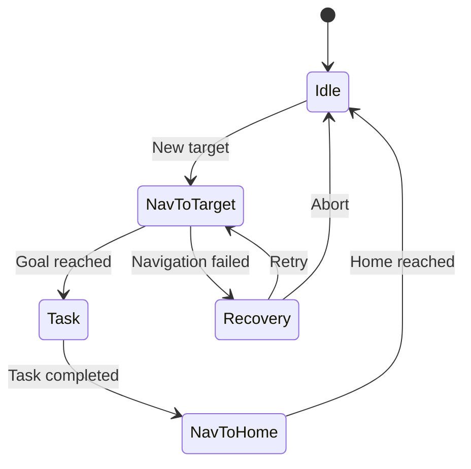
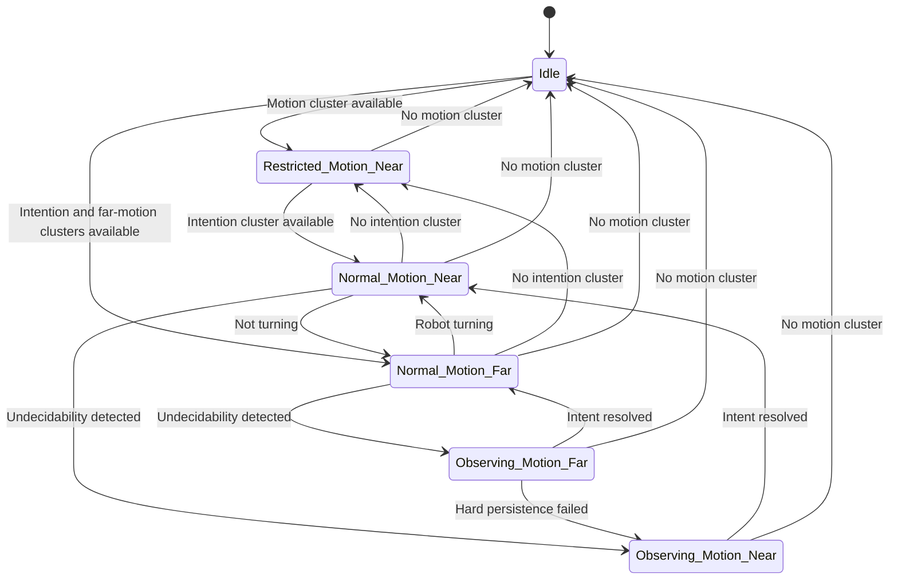
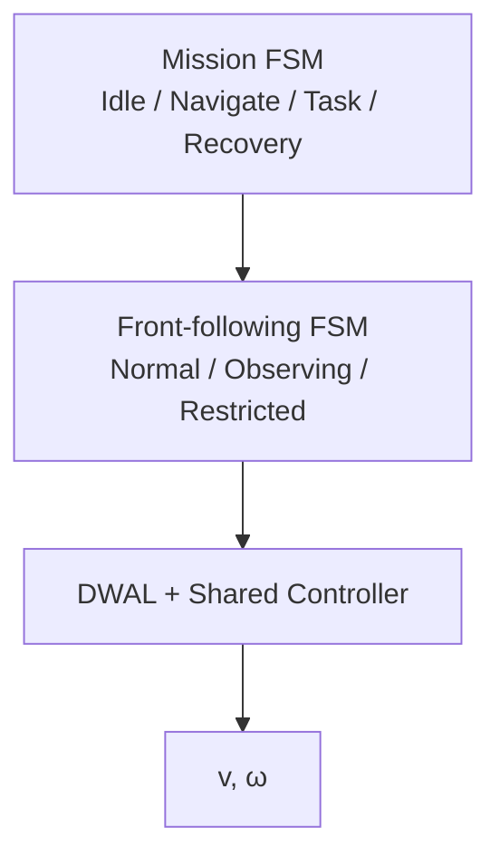
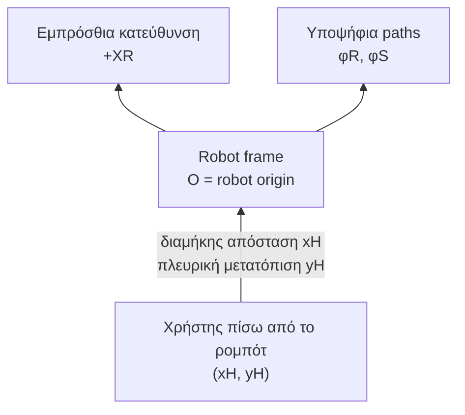
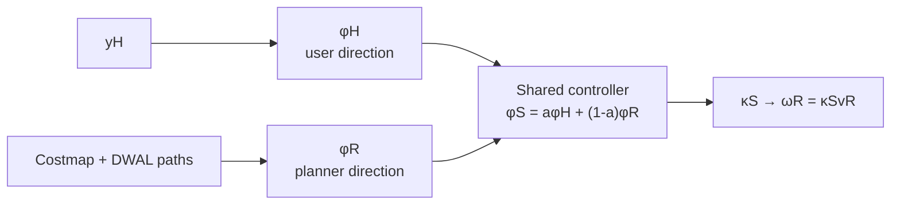
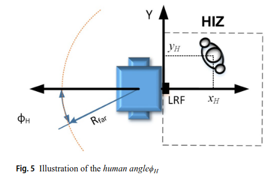
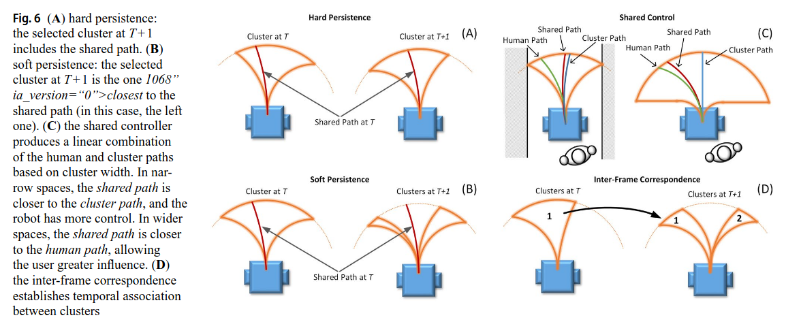
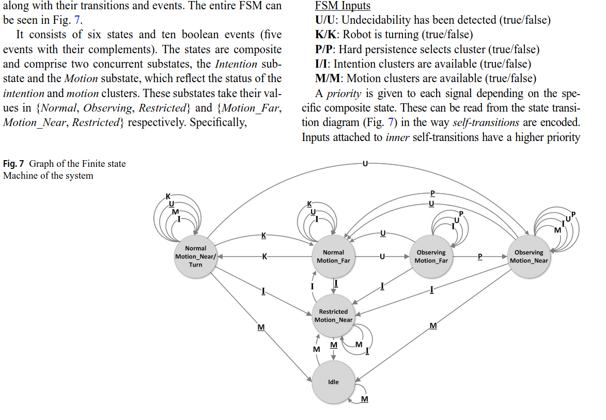

ROS 2 / Vulcanexus containerized Nav2 stack using the CoHAN-Nav2 / HATeb


### Moving
- NavToWareHouseState
- NavToHomeState
- NavToTargetState


kiro_nav does not know or care about the mission context — it receives a NavigateToPose goal and returns SUCCEEDED or ABORTED. The social awareness (yielding to, routing around workers) happens inside the HATeb optimizer, driven by live /tracked_agents data, invisibly to the caller.


Το FSM σημαίνει Finite State Machine — Μηχανή Πεπερασμένων Καταστάσεων.





Το Vulcanexus είναι διανομή και συλλογή εργαλείων της eProsima γύρω από:

ROS 2,
Fast DDS,
DDS Router / ROS 2 Router,
Discovery Server,
monitoring,
Record & Replay,
micro-ROS.

Δεν είναι διαφορετικό robotics framework που ανταγωνίζεται ευθέως το ROS 2. Είναι περισσότερο ένα ενισχυμένο ROS 2/DDS οικοσύστημα, ιδιαίτερα χρήσιμο για:

πολλά ρομπότ ή πολλούς υπολογιστές,
δύσκολα Wi-Fi δίκτυα,
σύνδεση διαφορετικών ROS domains,
απομακρυσμένα δίκτυα,
DDS security,
monitoring και καταγραφή επικοινωνίας.

4. Τι είναι το DDS

Το DDS — Data Distribution Service είναι middleware επικοινωνίας πραγματικού χρόνου με publish/subscribe μοντέλο.


Η εφαρμογή σου
     ↓
ROS 2 API: topics, services, actions
     ↓
RMW implementation
     ↓
DDS, π.χ. Fast DDS
     ↓
Network / shared memory

Άρα, όταν γράφεις:

ros2 topic pub ...

χρησιμοποιείς το ROS 2 API, αλλά στο χαμηλότερο επίπεδο τα δεδομένα μπορούν να μεταφερθούν μέσω Fast DDS.

5. ROS4HRI και ROS4RI
ROS4HRI

Το ROS4HRI — ROS for Human–Robot Interaction είναι ένα σύνολο από:


6. FIWARE και NGSI-LD
FIWARE

Το FIWARE είναι οικοσύστημα για διαχείριση context information σε εφαρμογές όπως:

smart cities,
smart buildings,
IoT,
digital twins,
βιομηχανικά συστήματα,
fleets και cloud services.

Κεντρικό στοιχείο είναι ο Context Broker.

Για παράδειγμα, μπορεί να αποθηκεύει ότι:

Robot17:
  location = Room_204
  battery = 73%
  mission = DeliverMedicine
  status = Navigating

Room_204:
  occupancy = 8
  accessibility = restricted
NGSI-LD

Το NGSI-LD είναι το τυποποιημένο API και data model για την ανταλλαγή αυτών των context entities.

Το LD σχετίζεται με Linked Data. Εκτός από properties, μπορείς να εκφράσεις σχέσεις:

Robot17 isLocatedIn Room_204
Robot17 executes Mission_53
Mission_53 requestedBy User_8

Άρα:

FIWARE = ευρύτερο οικοσύστημα και components,
Context Broker = server που διαχειρίζεται context,
NGSI-LD = κοινό API/data model που χρησιμοποιείται για την επικοινωνία με τον broker.

| Τεχνολογία         | Επίπεδο                          | Τι επιλύει                                          | Χρειάζεται στο project σου;            |
| ------------------ | -------------------------------- | --------------------------------------------------- | -------------------------------------- |
| **ROS 2**          | Robotics framework               | Nodes, topics, actions, lifecycle, integration      | **Ναι, βασικό**                        |
| **DDS / Fast DDS** | Communication middleware         | Μεταφορά δεδομένων και QoS                          | **Ναι, έμμεσα μέσω ROS 2**             |
| **Vulcanexus**     | ROS 2/DDS distribution και tools | Distributed networks, routing, monitoring, security | Όχι αρχικά                             |
| **ROS4HRI**        | Standard HRI interface           | Κοινή αναπαράσταση ανθρώπων                         | Πιθανώς χρήσιμο                        |
| **ROS4RI**         | —                                | Πιθανό typo του ROS4HRI                             | Όχι ξεχωριστή τεχνολογία               |
| **FIWARE**         | IoT/context/cloud ecosystem      | Digital twins και shared context                    | Μόνο αν απαιτείται εξωτερική πλατφόρμα |
| **NGSI-LD**        | Context API/data model           | Entities, properties και relationships              | Μόνο μαζί με FIWARE/context broker     |
| **DDS Enabler**    | Integration bridge               | DDS ↔ NGSI-LD/FIWARE                                | Μόνο για FIWARE integration            |
| **Mission FSM**    | Application logic                | Σειρά και κατάσταση αποστολής                       | Χρήσιμο, αλλά πάνω από το Nav2         |
| **Nav2/haTEB**     | Navigation                       | Trajectory planning και velocity commands           | **Ναι**                                |

---------------------
Nav paper

navigation συνολικό συτημα οδηγεί ρομποτ με ασφάλεια προς τον στόχο

GENERAL NAV
perception-tracking
localization(map)
global planning -> γενική διαδρομή
situation awareness
local planning -> τοπικές εφικτές κινήσεις
control -> επιλεγμένη κίνηση ->εκτελέσιμες εντολες


PAPER
- local planning -> παράγει τις ασφαλείς διαθέσιμες κινήσεις και τις ομαδοποιεί σε route clusters.
- intent recognition
- FSM
- shared controller (επιθυμητή κατεύθυνση χρήστη + ασφαλής κατεύθυνση planner =+-> velocity commands)

Το σύστημα έχει δύο παράλληλα pipelines:

Environment Pipeline
Ο local planner παράγει τις ασφαλείς διαθέσιμες κινήσεις και τις ομαδοποιεί σε route clusters.
User Pipeline
Παρακολουθεί τη σχετική θέση του χρήστη και μεταφράζει την κίνησή του σε επιθυμητή ταχύτητα και κατεύθυνση.

(Env pipeline + user pipeline) -> Cluster Selection(FSM)
-> shared controller→(v,ω)
Μόνο ο Shared Controller συνδυάζει όλες τις πληροφορίες και παράγει την τελική:

(v,ω)

συνήθως ως ROS μήνυμα geometry_msgs/Twist σε κάποιο topic τύπου /cmd_vel.

Anticipatory control+Passive control

DWAL — Dynamic Window Arc-Line.


Το CoHAN χρειάζεται να το βάλουμε σε διαφορετικό επίπεδο:

CoHAN = Cooperative Human-Aware Navigation framework/stack

| Μέθοδος            | Τι είναι                                                                                                                    |
| ------------------ | --------------------------------------------------------------------------------------------------------------------------- |
| **DWA**            | Ο αρχικός Dynamic Window Approach: δειγματοληπτεί ((v,\omega)), προσομοιώνει μικρές τροχιές και επιλέγει την καλύτερη.      |
| **DWB**            | Η modular υλοποίηση/εξέλιξη της λογικής DWA στο Nav2, με ανεξάρτητους critics.                                              |
| **TEB**            | Βελτιστοποιεί ολόκληρη τοπική τροχιά με χρονική πληροφορία και constraints.                                                 |
| **MPC**            | Model Predictive Controller: λύνει επαναληπτικά ένα optimization problem σε πεπερασμένο χρονικό ορίζοντα.                   |
| **DWAL**           | Dynamic Window Arc-Line planner του front-following paper· επέκταση της λογικής DWA με arc-line paths και route clustering. |
| **HATEB / HA-TEB** | Human-Aware Timed Elastic Band· επέκταση του TEB που μοντελοποιεί και προβλέπει ανθρώπινες τροχιές.                         |


## Local planner/controller families
```
├── Dynamic Window
│   ├── DWA
│   ├── DWB
│   └── DWAL
├── Trajectory optimization
│   ├── TEB
│   └── HATEB
└── Predictive optimization
    └── MPC

Wider navigation framework
└── CoHAN
    └── χρησιμοποιεί HATEB
```


3.2 Path Bundle Generation

Ο planner:

υπολογίζει το διαθέσιμο dynamic window από τις τρέχουσες v
R
	​

 και τα όρια επιτάχυνσης,
προσδιορίζει το επιτρεπόμενο εύρος καμπυλοτήτων,
παράγει ένα σύνολο arc και arc-line paths,
προσομοιώνει όλα τα paths μέχρι μια δεδομένη ακτίνα R.

Χρησιμοποιείται rolling local costmap από τον εμπρόσθιο laser scanner. Κάθε path:

ελέγχεται για collision,
κόβεται στο σημείο σύγκρουσης,
παίρνει cost σύμφωνα με τα costmap cells που διασχίζει.

Επομένως, το περιβάλλον λαμβάνεται υπόψη μέσω occupancy/costmap και obstacle clearance.

3.3 Clustering

Τα collision-free paths ομαδοποιούνται σε clusters. Κάθε cluster αντιστοιχεί σε μια διαφορετική διαθέσιμη route ή opening.

Απορρίπτονται:

πολύ μικρά clusters,
περάσματα που πιθανόν προέρχονται από θόρυβο,
ανοίγματα υπερβολικά στενά για ασφαλή διέλευση.

Για κάθε cluster επιλέγεται ως representative robot path εκείνο με το χαμηλότερο cost.

Υπάρχουν δύο επίπεδα:

- Far/intention level, R
far =4m: χρησιμοποιείται για να αναγνωριστούν διαφορετικές μελλοντικές routes.
- Near/motion level, R
near =2m: χρησιμοποιείται για την άμεση, πιο αξιόπιστη κίνηση.

Άρα το far level υποστηρίζει την απόφαση, ενώ το near level υποστηρίζει την εκτέλεση.

3.4 Directional Slicing

Κατά τη στροφή, ένα near cluster μπορεί να περιέχει κατευθύνσεις που είναι collision-free αλλά πρακτικά ανεπιθύμητες, π.χ. προς τον εξωτερικό τοίχο της στροφής.

Το directional slicing αφαιρεί αυτά τα τμήματα του cluster.

Αποτέλεσμα:

στενεύει το επιτρεπόμενο εύρος κίνησης,
αποφεύγονται άσκοπα wide turns,
η στροφή γίνεται πιο ομαλή και προβλέψιμη.

3.5 Inter-Frame Correspondence

Τα clusters αλλάζουν σε κάθε sensor frame:

μπορεί να μετακινηθούν,
- να διαιρεθούν,
- να συγχωνευθούν,
- να εμφανιστούν ή να εξαφανιστούν.

Ο αλγόριθμος αντιστοιχίζει clusters μεταξύ διαδοχικών frames βάσει της απόστασης των μέσων γωνιών τους και διατηρεί τα IDs τους.

Αυτό προσφέρει temporal consistency, απαραίτητη ώστε το σύστημα να μη θεωρεί συνεχώς μια ίδια route ως καινούργια.


4. Human Tracking & Input
Human velocity v
	​


Εξαρτάται από τη διαμήκη απόσταση x:

- αν ο χρήστης είναι πολύ μακριά, το ρομπότ σταματά,
- όταν πλησιάζει, το ρομπότ αρχίζει να κινείται,
στην κανονική walking zone κινείται με σταθερή ταχύτητα,
- αν ο χρήστης πλησιάσει υπερβολικά, το ρομπότ επιταχύνει ώστε να αποκαταστήσει την απόσταση.

Στα πειράματα η κανονική ταχύτητα είναι 0.5m/s και η μέγιστη 0.6m/s.

Human angle ϕ​.

Εξαρτάται από την πλευρική μετατόπιση y.

Υπάρχει deadband 0.1m, ώστε το φυσιολογικό lateral sway του βαδίσματος να μη μετατρέπεται σε εντολή στροφής.

Για να δηλώσει στροφή, ο χρήστης μετακινείται σκόπιμα προς τη μία πλευρά. Η κίνηση είναι ελαφρώς αφύσικη, αλλά αυτό χρησιμοποιείται επίτηδες ως ισχυρό σημάδι πρόθεσης.

5. Cluster Selection

Η κεντρική αρχή είναι:

Ο χρήστης επιλέγει το cluster, ενώ το ρομπότ επιλέγει το path μέσα στο cluster.

Άρα:

ο χρήστης παίρνει τη high-level απόφαση «αριστερά, δεξιά ή ευθεία»,
ο planner επιλέγει την ασφαλέστερη συγκεκριμένη τροχιά μέσα στη route.

5.2 Persistence

Μετά την επιλογή ενός cluster, το σύστημα πρέπει να διατηρεί την επιλογή καθώς τα clusters μεταβάλλονται.

Χρησιμοποιούνται δύο στρατηγικές:

Soft persistence: επιλέγεται το νέο cluster που βρίσκεται πιο κοντά στο προηγούμενο shared path. Χρησιμοποιείται στην κανονική πλοήγηση.
Hard persistence: το νέο cluster πρέπει να περιέχει πραγματικά το προηγούμενο shared path. Χρησιμοποιείται κατά την undecidability.

Αν το hard persistence αποτύχει:
το σύστημα δοκιμάζει το near-level cluster,
αν αποτύχει και αυτό, επιλέγει το cluster με το μεγαλύτερο intent score.

6. Shared Controller

Ο controller καθορίζει πόσο έλεγχο έχει ο χρήστης και πόσο το ρομπότ, με βάση το πλάτος $W
_C$ του επιλεγμένου motion cluster.

Η shared direction είναι:


$ ϕ_S = a ϕ_H +(1−a) ϕ_R$
	​


όπου:

$ϕ_H$ : επιθυμητή κατεύθυνση χρήστη,


$ϕ_R$ : βέλτιστη κατεύθυνση planner,


$ϕ_S$ : τελική shared κατεύθυνση,


a: authority του χρήστη.

Η βασική λογική είναι:

ευρύς χώρος: a→1, περισσότερο control στον χρήστη,
στενός χώρος: a→0, περισσότερο control στον planner/robot.

Από το $ϕ_S$ υπολογίζεται η curvature $κ_S$ και τελικά:

$ω_R =κ_S + v_R$
	​


Η γραμμική ταχύτητα προέρχεται κυρίως από το human-input module, αλλά:

μηδενίζεται στο Idle,
μειώνεται στο μισό κατά το Observing,
παραμένει κανονική στις υπόλοιπες καταστάσεις.

Επομένως, αυτός είναι ένας πραγματικός planner-controller συνδυασμός: ο planner παρέχει safe motion geometry και ο controller τη μετατρέπει σε v,ω, συγχωνεύοντάς την με την επιθυμία του χρήστη.

7. Finite State Machine

Η FSM συντονίζει όλο το σύστημα. Περιλαμβάνει δύο παράλληλες έννοιες state:

Intention substate

- Normal: υπάρχουν intention clusters, χωρίς undecidability.
- Observing: υπάρχει undecidability και παρατηρείται ο χρήστης.
- Restricted: δεν υπάρχουν far/intention clusters.


Motion substate

- Motion_Far: η άμεση κίνηση βασίζεται στο far level.
- Motion_Near: χρησιμοποιείται το near level.
- Restricted: δεν υπάρχει διαθέσιμο motion cluster.

Οι πραγματικές σύνθετες καταστάσεις είναι έξι:

- Normal–Motion_Far
- Normal–Motion_Near
- Observing–Motion_Far
- Observing–Motion_Near
- Restricted–Motion_Near
- Idle

Οι transitions εξαρτώνται από:

εμφάνιση undecidability,
αν το ρομπότ στρίβει,
επιτυχία ή αποτυχία persistence,
διαθεσιμότητα intention clusters,
διαθεσιμότητα motion clusters.

Η FSM είναι ουσιαστικά το situation/behavior arbitration layer του paper.


-----
WEEK 3


Local Planners-Nav controllers vs controllers ΣΣΑΕ

Στο robot coordinate frame:

- O: κέντρο/αρχή του ρομπότ,
- $X_R​$: διαμήκης άξονας, προς τα εμπρός,
- $Y_R$: πλευρικός άξονας,


| Σύμβολο        | Σημασία                                              |
| -------------- | ---------------------------------------------------- |
| $(\Delta\Theta)$ | Πραγματική αλλαγή heading πάνω στο αρχικό arc        |
| $(\phi)$         | Γεωμετρική παράμετρος ενός υποψήφιου DWAL path       |
| $(\phi_H)$       | Επιθυμητή κατεύθυνση που προκύπτει από το (y_H)      |
| $(\phi_R)$       | Γωνία του καλύτερου path μέσα στο επιλεγμένο cluster |
| $(\phi_S)$       | Τελική shared κατεύθυνση                             |




Πώς προκύπτει το costmap;

Στο paper:

Ο εμπρόσθιος LRF παράγει laser scans.
Τα measurements μετασχηματίζονται στο robot/costmap frame.
Οι ακτίνες:
σημειώνουν τα hits ως obstacles,
καθαρίζουν τον ενδιάμεσο χώρο ως free.
Παράγεται rolling 2D costmap κεντραρισμένο στο ρομπότ.
Τα cells χαρακτηρίζονται ως:
free,
unknown,
obstacle,
ή ενδιάμεσο κόστος ανάλογα με την απόσταση από εμπόδια.








